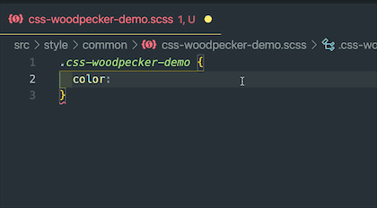
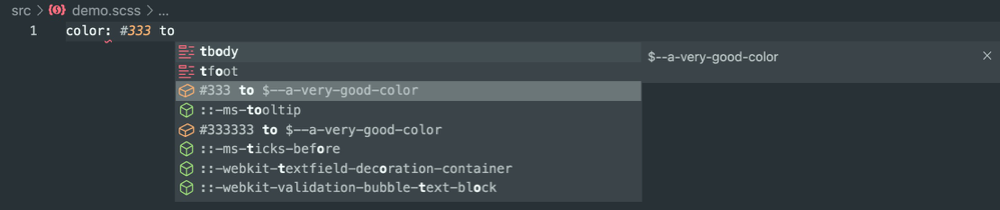
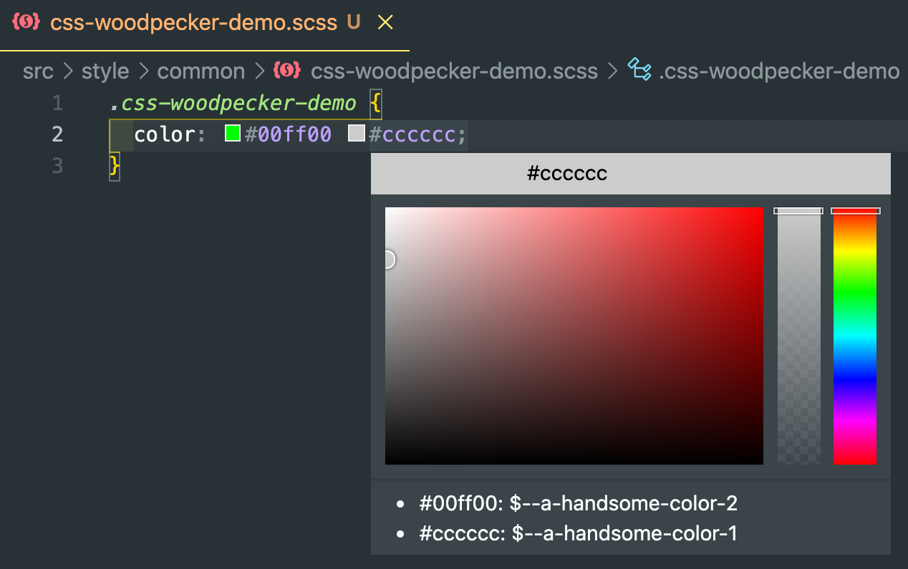

# css-woodpecker README

> 一个css变量转换插件

## Example
+ css 颜色值到css变量名的快速转换

+ css 颜色值为纯数字时请在色值后面添加 空格to


+ hover时的css变量值hover到css变量名的提示


## Extension Settings
### Setting Path

项目下的 `.vscode` 文件夹内创建 `.cssWoodpecker` 文件

`/.vscode/.cssWoodpecker`
### Settings Demo
```
{
  "color":{
    "enable":true, // 是否启用颜色转换
    "configPath":"src/style/foo/bar.scss" // 配置文件在项目中的相对路径
  }
}
```
## Release Notes

### 1.0.0

+ 提供了css变量值到css变量名的快速转换
+ 提供了hover时的css变量值hover到css变量名的提示

### 1.0.1

+ 添加图标

### 1.0.2

+ Readme update
### 1.0.3

+ 支持纯数字色值转换

-----------------------------------------------------------------------------------------------------------

**Enjoy!**
